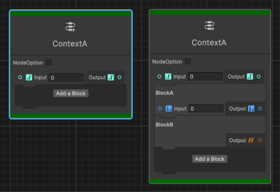
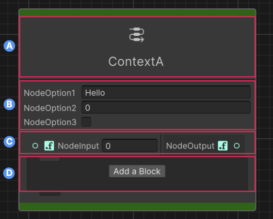
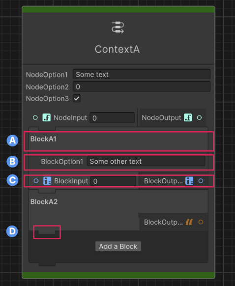

# Introduction to context nodes

Discover how context nodes and block nodes function together and learn about their visual structure and UI components.

## Overview of context nodes

Context nodes act as specialized containers that dynamically organize related functional components known as block nodes.
They allow you to add, remove, and reorder these blocks within a cohesive structure.
Context nodes allow you to configure settings that apply to all contained blocks and control which blocks each context node can accept.

The previous image shows two different instantiations of the same context node named `ContextA`:

* the first without blocks,
* the second where the user added two blocks.

## Context node structure

The details of a context node:  
A: **Header** - Title and icon of the context node.  
B: **Options panel** (optional) - General settings that affect the entire context.  
C: **Input/output ports** (optional) - Connection points for the context node.  
D: **Blocks container** - Houses block nodes and the `Add block` button.  

## Understand block nodes

Block nodes are special nodes that exist exclusively within context nodes. They're responsible for performing a single operation or behavior. Unlike regular nodes, blocks can't exist independently in the graph.

Each block type works with specific context node types and can take inputs, produce outputs, and participate in the execution flow defined by its parent context.

> [!NOTE]
> Graph Toolkit doesn't enforce a specific execution order but it displays visual indicators known as etches between blocks. These etches visually represent the execution sequence.

## Block node structure

The details of a block node:  
A: **Header** - Block title.  
B: **Options panel** (optional) - Block-specific settings.  
C: **Input/output ports** (optional) - Connection points specific to this block.  
D: **Etch** - Execution visual indicator.  

## Workflow with context nodes

The following steps represent a general workflow for using context nodes. The process might vary depending on your specific use cases. Refer to [Context nodes usage](context-node-usage.md) to learn how you can apply context nodes in different scenarios.

General steps to use context nodes in your graph tool:

1. [Implement a context node](context-node-implement-context-node.md).
1. [Instantiate context nodes in your graph](context-node-instantiate-context-node.md).
1. [Implement a block node](context-node-implement-block-node.md).
1. [Instantiate and manage block nodes](context-node-instantiate-manage-block-node.md).
