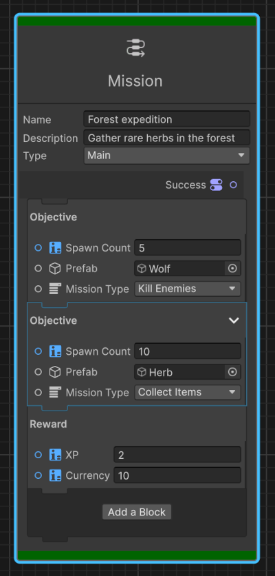

# Context nodes usage

Explore the following documentation to discover the value of context nodes and guidance on when to use them, illustrated with relevant Unity examples.

Before you proceed, please make sure you're familiar with the concepts described in [Introduction to context nodes](context-node-introduction.md).  
If you're looking for technical implementation guidance, refer to [Implement a context node](context-node-implement-context-node.md).

## When to use context nodes

Context nodes are valuable when:

* multiple operations logically belong together
* operations need to follow a specific execution order
* multiple operations require the same parameters
* you need to restrict operations users can perform in a section
* complex logic must be broke down into manageable segments

## Use case examples

Here are two examples to highlight the previous scenarios.

### Example 1: A cinematic look

In the context of a post-processing pipeline, consider a Cinematic Look context node that can contain blocks for depth of field, bloom, grading, grain, and vignette effects.
Each block handles a specific post-processing effect, while sharing a global opacity setting. The user can choose to use one or several effects, the order of the blocks has an effect on the final look.

The Cinematic Look context node demonstrates how you can use a context node to do the following:

* group visual effects and have a unified toggling,
* process the visual effects in the correct rendering sequence,
* govern the rendering via a shared global parameter, like opacity,
* constrain the context node to include only rendering-compatible blocks.

This design ensures artistic integrity and simplified control.

### Example 2: A mission system

In the context of a mission system, consider a context node to define a mission with blocks for objectives and rewards.
Game designers can add objectives blocks of different types like collecting items, killing enemies, going to a location
and assign a specific prefab representing the objects to spawn (for example: herbs, wolfs).
They can also add reward blocks to provide the player with XPs and currencies on success.

The Mission Context node is another demonstration of how you can use context nodes to do the following:

* group related quest elements together,
* enforce the correct sequence (player must complete the objectives before receiving rewards),
* allows the game designer to define common settings once and use them in all blocks,
* prevent the game designer to insert incompatible blocks into the mission flow
