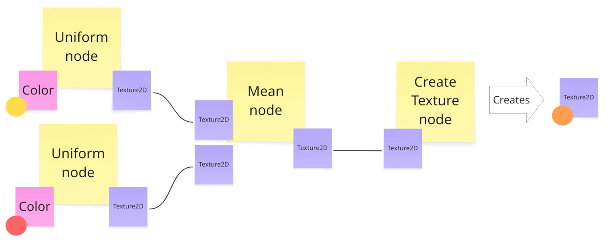

# Design your graph tool with Graph Toolkit

This page outlines design guidelines for graph tools using Unity's Graph Toolkit.

## The design phase

Building a graph tool is complex. The design phase is crucial for establishing a solid foundation and preventing issues. Clearly define your graph tool’s purpose and structure.

## Core design factors

> [!NOTE]
> The following core design factors are illustrated with examples from the Texture Maker sample.

* **Idea**: What is the core concept or purpose of your tool?
  * Example: A tool for visually creating and editing textures using a simple interface.
* **User story**: Who is the target user and what do they want to achieve with your tool?
  * Example: "As a Unity technical artist, I want a modular texture tool to design, edit, and visualize textures to create and customize materials for 3D models and environments".
* **Features**: What specific functionalities will your tool provide?
  * Example: Export textures in PNG, real-time previews for enhanced editing.
* **Need for a graph solution**: Consider this early to avoid design issues.
  * A graph structure is appropriate if entities and relationships between entities are central to your workflow.
  * Alternatively, a linear sequence representation serves use cases focused on sequential progression or time-based events.
* **Graph tool name**: What is the unique name for your graph tool? The process of finding a name compels you to ask fundamental design questions, which significantly clarifies the tool's purpose and scope.
  * Example: Texture Maker.
* **Runtime integration**: What is the nature of your tool's runtime model? Consider how its data structures and operations are defined. Also consider when the graph will be executed. This will guide you for the integration with Graph Toolkit.
  * Example: Nodes represent texture operations, wires connect them to define the flow of operations, and variables store input parameters (colors or textures). The data is processed to generate the corresponding texture when the graph is saved.
* **Runtime execution model (push vs. pull)**: This defines how your runtime processes data.
  * Use a [push model](glossary.md#push-model) when data flows from inputs to a final output, such as in a shader graph where data transforms progressively.
  * Use a [pull model](glossary.md#pull-model) for reactive or dependency-driven systems, such as an animation state machine evaluated on demand.
  * A mixed execution model implementation is also possible. This often involves push-based events triggering graph execution, with data within the flow pulled as needed. Conversely, primarily pull-based systems use push for infrequent updates of cached or constant data.

## Implementation strategy

* Start simple: Use a whiteboard and sketch a graph example to visualize your idea. Here's an example of a post-it design based on Texture Maker:

* Break down your use case into nodes and relationships. This helps define the structure and features of your graph tool.
* **Implement your custom runtime first**. Define the core data structures and logic for your graph tool's functionality. This ensures the foundational behavior is solid and independent of the editor UI.
  * Integration involves mapping Graph Toolkit's editor-time representations (like `Graph` and `Node` classes) to your custom runtime data model.
  * A scripted importer often handles this conversion. The [Texture Maker sample code](texture-maker-sample-explore-the-code.md) provides an example of a scripted importer converting the graph into an existing Unity runtime object (a `Texture2D`). The [Visual Novel Director sample](visual-novel-director-explore-the-code.md) provides another example of a scripted importer transforming the graph into a custom runtime object with its own behavior.
