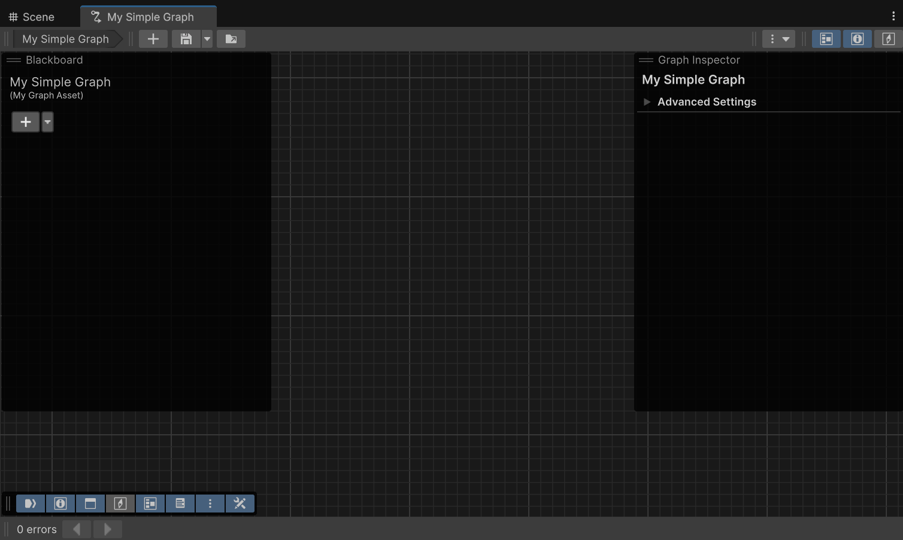
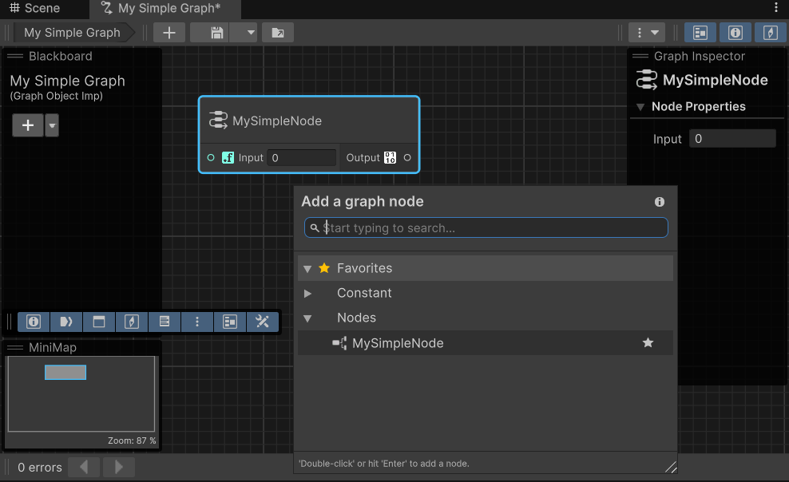

# Get started with coding your own graph tool with Graph Toolkit

This guide walks you through the initial steps of creating your own simple graph tool with a graph window, a custom node and custom types.

It covers:

* [Setting up your code structure](#set-up-your-code-structure)
* [Creating your graph tool's foundations](#step-1-define-your-custom-graph-class)
* [Creating your first node](#step-2-create-your-first-node)

## Set-up your code structure

Start by creating a folder to store all your scripts. It's recommended to organize your classes into separate files to build a strong foundation for when you fully implement your tool.

Although not required at this stage, it's a good idea to create an assembly to start organizing your code now. This assembly must specifically target the Editor, as Graph Toolkit is meant for Editor use only.

Here's a basic example of an assembly you can use:

[!code-csharp]

You can find more details on how to create an assembly definition in the [Unity documentation](https://docs.unity3d.com/Manual/assembly-definition-files.html).

## Step 1: Define your custom Graph class

The foundation of any Graph Toolkit tool is a custom `Graph` class. Follow these steps to create yours:

1. Create a new C# script file and import the necessary namespaces:

[!code-csharp]

1. Add a class `MySimpleGraph` that inherits from `Graph`
1. Define an `AssetExtension` constant to specify your graph's file extension
1. Apply the `[Graph]` attribute and pass your extension as a parameter
1. Mark your class with `[Serializable]` to ensure proper data persistence as you extend your graph tool
1. Finally, add a new `CreateAssetFile()` function that calls `PromptInProjectBrowserToCreateNewAsset` method and decorate this function with a `MenuItem` attribute

[!code-csharp]

This basic implementation creates the core structure for your graph tool. The `AssetExtension` constant defines the file format Unity will use when saving your graph assets.

The `CreateAssetFile()` function allows you to create a new graph asset directly from the Unity Editor's menu. Navigate to `Assets > Create > Graph Toolkit Samples > Simple Graph`. The new asset appears in the Assets section of the project window with its name in edit mode, ready for you to type.

After naming it, double-click the file to open your brand-new graph editor window. Your graph tool looks similar to the following:

## Step 2: Create your first node

Let's now add a node by adding a new class that extends `Node`:

[!code-csharp]

That's it! Because you defined the node in the same assembly as the graph, it's automatically registered and added to the graph item library which makes it discoverable in the search window.

As recommended earlier, apply the `[Serializable]` attribute to your class to ensure Unity preserves your data during serialization as you extend the functionality of your custom node.

At this point, you can add this node to your canvas, though it currently lacks input and output ports.

Enhance its functionality by defining a float input port and a custom type output port:

[!code-csharp]

## It's a wrap

That's it. You have covered the basics.

Here's your final script:

[!code-csharp]

And some recommendations for next steps:

* Check out the [Graph Toolkit samples](samples.md) to learn more advanced features and implementations.
* Explore the [Graph Toolkit user manual](index.md) and [Graph Toolkit API documentation](https://docs.unity3d.com/Packages/com.unity.graph-toolkit@latest/api/index.html) to learn more about the available classes and methods.
