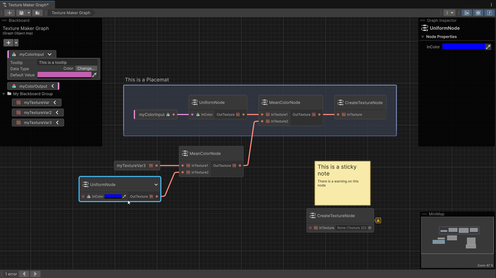

# Introduction to Graph Toolkit

[!INCLUDE [Experimental Warning message](experimental-release.md)]

This document provides an overview of the Unity Graph Toolkit. It covers the purpose, target audience, value proposition, scope, and limitations.

## Purpose

[!INCLUDE [Graph Toolkit's purpose](purpose.md)]

## Target audience

Graph Toolkit targets **Tools Programmers** who:

- Create tools that enable non-technical teammates to build game systems codelessly
- Need to establish visualization and logic flow systems
- Require standard approaches to creative problem-solving
- Want to reduce bottlenecks in the development pipeline

The framework best serves developers who need to create specialized graph-based tools that allow designers, artists, and other team members to work independently without constant programmer intervention.

## Value proposition

Graph Toolkit delivers three core benefits:

### Development efficiency

- Inherit ready-made features: node/wire manipulation, asset management, and standard editing operations
- Focus on domain-specific functionality rather than graph infrastructure
- Reduce development time by leveraging built-in UI components and interaction patterns

### Consistent user experience

- Provide familiar interface patterns across different graph tools to reuse muscle memories and reduce user cognitive load
- Implement Unity UI and UX guidelines automatically
- Maintain coherent behaviors for common operations (selection, navigation, editing)

### Comprehensive editing features

- [Blackboard](glossary.md#blackboard) for variable management
- Visual navigation through [minimap](glossary.md#minimap)
- [Graph inspector](glossary.md#graph-inspector) for property editing
- [Subgraph](glossary.md#subgraph) support for complex hierarchies
- Undo/redo functionality for graph changes
- Support for missing node types with graceful degradation

You can find more about these features in the [Features](features.md) section.

## Scope and limitations

### What Graph Toolkit provides

- Editor-time graph creation and manipulation
- UI components based on Unity's UI Toolkit
- Node and connection visualization system
- Standard interaction patterns and manipulators
- Customizable nodes

### What  Graph Toolkit doesn't Provide

- Runtime graph execution backend
- Runtime rendering of graph UI (for example, in-game / in-application graphs that players can interact with in builds)
- Application-specific node implementations

Graph Toolkit is a frontend framework focused on the authoring experience. While it supports compilation to runtime models, it doesn't include runtime execution backends. You will need to implement domain-specific runtime solutions for your particular use case.

> [!NOTE]
> To refer to a practical example of how a Graph Toolkit graph can drive runtime behavior, check out the [Visual Novel Director sample](visual-novel-director-introduction.md).
