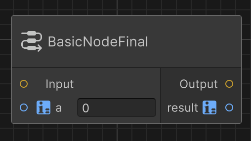

# Instantiate nodes in your graph

You need to implement a node, as described in [Implement a node](node-implement.md), before instantiating a node.

To instantiate a node:

1. Right-click on the graph canvas then select `Create node...` to open the graph item library window.
1. Navigate to the **Nodes** category.
1. Double-click on your node name to add it to your graph.
    * You can click on the `i` icon on the top-right corner of the graph item library window to have a preview of the selected node.

## Next step

[Implement node options](node-option.md)