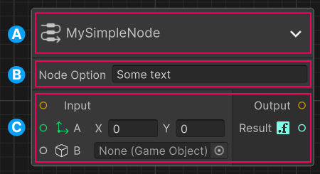

# Introduction to nodes

In the context of graph tools, a node is a modular building block that represents a specific operation, piece of data, or functionality. Nodes are visual elements that can connect together to define workflows, processes, or systems. Each node typically has inputs, outputs, and internal logic that determines how it processes information.

Think of nodes as puzzle pieces or blocks in a construction set. Each node serves a specific purpose. When combined with other nodes, they create a larger, more complex structure or tool.

> [!NOTE]
> Graph Toolkit doesn't provide any predefined nodes, but provides an API so you can build your own nodes with their own logic to meet the needs of your application.

## Anatomy of a node

Before you start coding your own node, understand what makes up a node.

The following image shows the different parts of a node.

The details of a node:  
A: **Header** - The icon, the title and the collapse node button. Note the collapse node button only appears when you position the mouse over the node.\
B: **Options panel** (optional) - General settings that affect the entire node.\
C: **Input/output ports** (optional) - Connection points for the node.

## Working with nodes

The following steps represent the general workflow with nodes from creation to usage.

1. [Implement a node](node-implement.md)
1. [Instantiate nodes in your graph](node-instantiate.md)
1. [Implement node options](node-option.md)