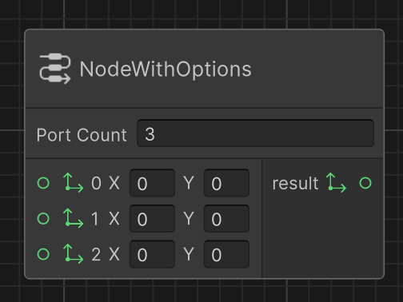
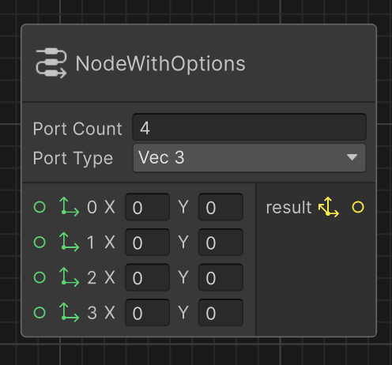

# Implement node options

Node options provide a way to dynamically customize node behavior and structure without creating multiple node variants. They allow a single node type to adapt to different scenarios through configurable settings, simplifying your node hierarchy while maintaining flexibility.

This documentation shows how to use node options to dynamically adjust both the number of ports and their data types.

## Add a node option to change the number of ports of a node

To create a node with a configurable number of ports:

1. Define a constant name for your port count option.
1. Override `OnDefineOptions` to create the option with a default value.
1. Apply the `DelayedAttribute` to defer processing until input is complete.

> [!NOTE]
> Right now Graph Toolkit only supports the `DelayedAttribute` on node option but the support for more attributes (e.g `MultilineAttribute`) is coming.

[!code-csharp]

Finally, implement `OnDefinePorts` to create ports based on the option value:

[!code-csharp]

The `GetNodeOptionByName` method retrieves your option using its name, then `TryGetValue` extracts its current value. This pattern allows your node to dynamically adjust its structure based on user configuration.

Now open your graph and instantiate your node to check the result. The node look similar to the following:

## Add a node option to change the type of ports of a node

To create a node with switchable port data types:

1. Define an enum for your type options.
1. Create an option that uses this enum as its type.
1. Use the selected enum value to determine port data types.

> [!NOTE]
> This time there's no `DelayedAttribute` as the port needs to change as soon as port type option changes.

[!code-csharp]

Go back to the graph and use your two new options to change the layout of your node. Your node now look similar to the following:

## Complete node option example

[!code-csharp]
