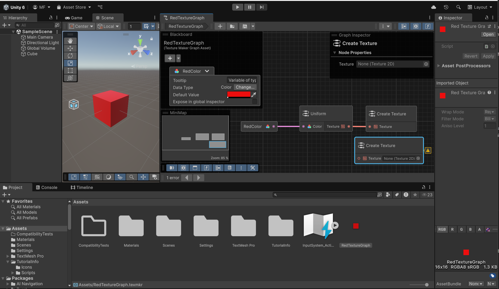

# Introduction to the Texture Maker sample

## About the sample

Texture Maker sample demonstrates how to build a Unity Graph Toolkit graph tool where the graph asset works with a [Scripted Importer](https://docs.unity3d.com/Manual/ScriptedImporters.html) rather than using Unity's built-in `.asset` files. The sample features a basic texture generation graph tool to showcase these concepts.

Learn how to:

* Create a new graph tool with Graph Toolkit
* Implement a custom graph asset using Scripted Importers
* Design and build custom nodes
* Override the `OnGraphChanged` method to display errors and warnings directly in the graph editor

> [!NOTE]
> This sample serves as a learning resource only and lacks the features of a production texture creation tool. The architecture prioritizes clarity and educational value over comprehensive functionality.

## About the Texture Maker graph tool

Texture Maker lets you create textures through a node-based graph interface.

The tool contains three types of nodes:

* Uniform nodes - Produce the corresponding uniform texture when you select a color,
* MeanColor nodes - Compute the mean color of the input textures,
* CreateTexture nodes - Serve as the final point in the texture graph, where the texture is computed and evaluated.

Texture Maker graph asset contains a texture, which means that you can drag it onto a scene object to apply it.

A graph supports only one CreateTexture node. Additional CreateTexture nodes trigger warning flags, and only the first one functions.

Here's a first simple task to get you started:

* Add a passthrough node to the graph. This node can take a texture as input and output the same texture.

And here are some ideas for extending this sample and getting more familiar with Graph Toolkit:

* Add more nodes to the graph, such as a clamp node, noise node, or a gradient node,
* Allow the user to change the texture resolution,
* Add basic math nodes to the graph, such as add, subtract, multiply, and divide,
* Instead of picking the first CreateTexture node, check the first CreateTexture node that is connected to an evaluable node.
