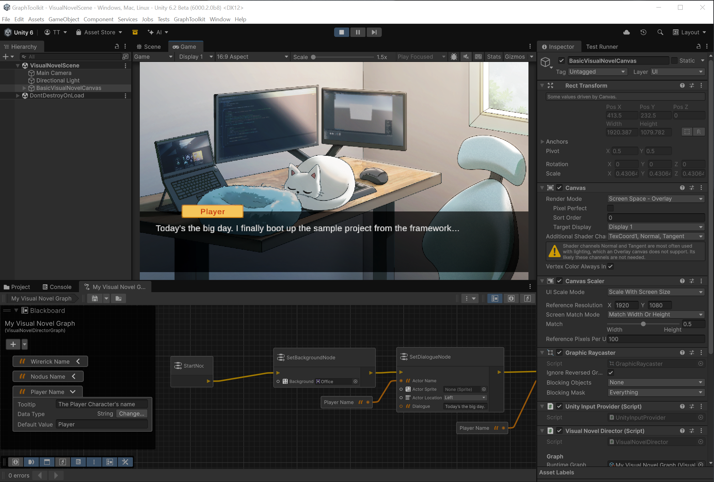

# Introduction to the Visual Novel Director sample

## About the sample

The Visual Novel Director sample showcases the process of creating a Unity Graph ToolKit graph tool that drives runtime behaviour (executing code in PlayMode or in builds based on the graph).

This sample is a basic graph tool that plays through a typical 'Visual Novel' style game and shows you how to use Graph Toolkit to:

* Build a custom runtime asset from the graph asset using a Scripted Importer
* Bind a runtime asset to your Graph Toolkit graph asset

> [!NOTE]
> This sample is intended as a learning resource and is not designed to function as a fully-featured visual novel game. Certain architectural decisions were made to keep the sample simple and focused on demonstrating key concepts.

> Thanks to Olivia You-Tuon (@shumijin) for the visual novel assets used in this sample.

## About the Visual Novel Director graph tool

With the Visual Novel Director, you can use a graph to direct a visual novel at runtime.

The tool contains four types of nodes:

* Start nodes - Indicates the starting point of the visual novel.
* SetBackground nodes - Sets the background image of the scene.
* SetDialogue nodes - Plays dialogue and sets up the related actor sprite and position in the scene.
* WaitForInput nodes - Waits for the players input before continuing the graph execution.

A graph can contain only one Start node. If the user adds multiple instances, only the first one is
used. Any others are flagged with a warning.

WaitForInput nodes can be added to the graph to wait for player input after a background image change. Using a SetDialogue node will implicitly wait for input after the dialogue is completed.

The tool also includes an example custom runtime. The runtime includes a runtime graph `ScriptableObject` that contains the runtime data and a VisualNovelDirector component that's responsible for executing the runtime graph.

For simplicity's sake the sample plays a linear visual novel with no decisions, branching or conditions.

The sample tool includes a `BasicVisualNovelCanvas` prefab that includes all the UI elements needed to display the visual novel with the right references set up for the `VisualNovelDirector`. The prefab includes:

* A background image - This is the image that is displayed in the background of the scene.
* A character layer - This is the layer that displays the character sprites, with multiple child images to display a character sprite in different locations.
* A dialogue box - This is the box that displays the dialogue text.
* A speaker name box - This is the box that displays the name of the character speaking.

The general end-user flow of the tool is as follows:

1. The user creates a new visual novel graph, creates nodes as required and connects them.
1. The user saves the graph. This builds the runtime asset (on import) and sets up the runtime asset to be part of the same asset on disk.
1. The user drags the graph asset into the scene onto a `VisualNovelDirector`.
1. The user configures the `VisualNovelDirector` component with the other UI component references in the scene to drive runtime behaviour.
1. Enter play mode and watch the visual novel scene play out.

Some ideas for extending this sample and getting more familiar with Graph Toolkit:

* Add more nodes to the graph, such as a SetMusic node (would require an audio source in the scene).
* Implement choices and branching in the graph with its related runtime representation.
